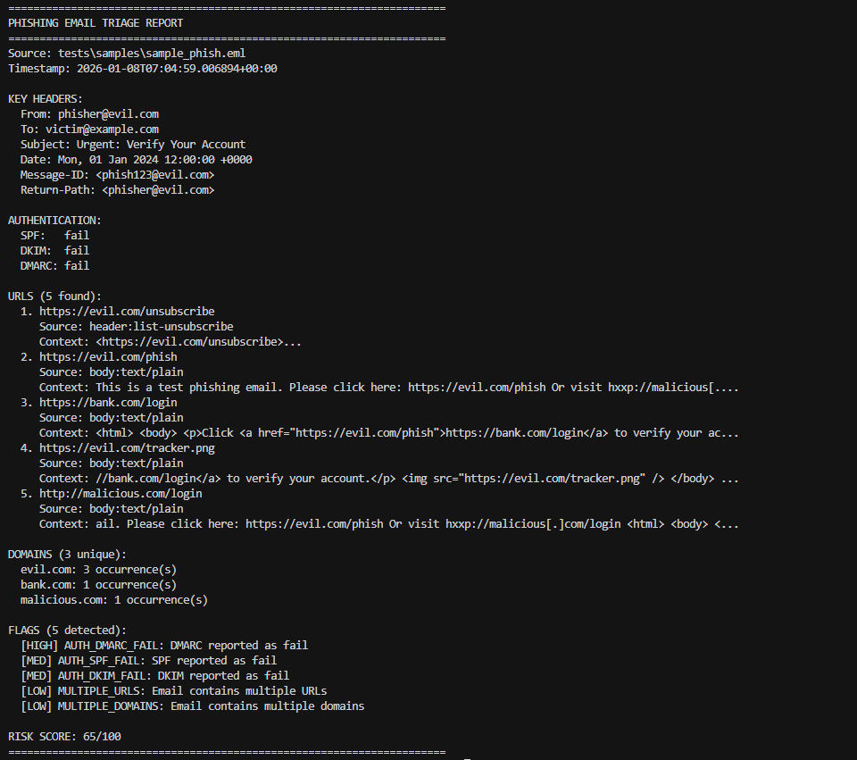

# Phishing Buddy

A clean, testable CLI tool for phishing email triage that parses `.eml` files and outputs JSON triage reports.

## Features

- Parse `.eml` email files with full header preservation
- Extract URLs from headers and body (plain text and HTML)
- Extract and count domains from URLs
- Parse authentication results (SPF, DKIM, DMARC)
- Detect phishing indicators (link mismatches, defanged URLs, etc.)
- Compute risk scores with explainable flags
- Output JSON reports with optional human-friendly summaries

## Demo

### Analyze an email
```bash
phishing-buddy tests/samples/sample_phish.eml --summary
```

Result:


### Output JSON
```bash
phishing-buddy tests/samples/sample_phish.eml --out demo/report.json --pretty
```

Result:
[Sample JSON File](demo/report.json)

## Installation

### Development Setup

1. Clone the repository:
```bash
git clone https://github.com/SeveralFaun/phishing-buddy
cd phishing-buddy
```

2. Install in development mode:
```bash
pip install -e ".[dev]"
```

Or install dependencies manually:
```bash
pip install tldextract pytest
pip install -e .
```

3. Verify installation:
```bash
phishing-buddy --help
```

## Usage

### Basic Usage

Analyze an email file and output JSON to stdout:
```bash
phishing-buddy path/to/email.eml
```

### Options

- `--out <path>`: Write JSON output to a file instead of stdout
- `--pretty`: Pretty-print JSON output with indentation
- `--summary`: Print a human-friendly summary to stdout
- `--max-urls <n>`: Cap displayed URLs in summary mode (default: 20)
- `--include-raw`: Include a small raw preview of text/plain and text/html (first 200 chars)

### Examples

**Pretty JSON output:**
```bash
phishing-buddy email.eml --pretty
```

**Save to file with summary:**
```bash
phishing-buddy email.eml --out report.json --summary
```

**Full analysis with raw preview:**
```bash
phishing-buddy email.eml --pretty --summary --include-raw --max-urls 50
```

**Using as Python module:**
```bash
python -m phishing_buddy.cli email.eml --summary --pretty
```

## Output Format

The tool outputs a JSON report with the following structure:

```json
{
  "source_file": "path/to/email.eml",
  "timestamp_utc": "2024-01-01T12:00:00+00:00",
  "headers": {
    "from": ["sender@example.com"],
    "to": ["recipient@example.com"]
  },
  "key_headers": {
    "From": "sender@example.com",
    "To": "recipient@example.com",
    "Subject": "Email Subject",
    "Date": "Mon, 1 Jan 2024 12:00:00 +0000",
    "Message-ID": "<msg123@example.com>",
    "Return-Path": "<sender@example.com>"
  },
  "auth_summary": {
    "spf": "pass|fail|none|permerror|temperror|neutral|softfail|unknown",
    "dkim": "pass|fail|none|permerror|temperror|neutral|unknown",
    "dmarc": "pass|fail|none|permerror|temperror|neutral|unknown",
    "raw": ["raw Authentication-Results header values"]
  },
  "urls": [
    {
      "url": "https://example.com/page",
      "source": "body:text/html",
      "context": "optional short snippet"
    }
  ],
  "domains": [
    {
      "domain": "example.com",
      "count": 3
    }
  ],
  "flags": [
    {
      "id": "DEFANGED_URL",
      "severity": "low|med|high",
      "message": "Description of the issue",
      "evidence": {}
    }
  ],
  "risk_score": 75,
  "raw_preview": {
    "text/plain": "preview of plain text...",
    "text/html": "preview of HTML..."
  }
}
```

## Sample Output

### Summary Mode

```
======================================================================
PHISHING EMAIL TRIAGE REPORT
======================================================================
Source: email.eml
Timestamp: 2024-01-01T12:00:00+00:00

KEY HEADERS:
  From: sender@example.com
  To: recipient@example.com
  Subject: Urgent: Verify Your Account
  Date: Mon, 1 Jan 2024 12:00:00 +0000

AUTHENTICATION:
  SPF:   fail
  DKIM:  fail
  DMARC: fail

URLS (2 found):
  1. https://evil.com/phish
     Source: body:text/html
  2. hxxp://malicious.com/login
     Source: body:text/plain

DOMAINS (2 unique):
  evil.com: 1 occurrence(s)
  malicious.com: 1 occurrence(s)

FLAGS (3 detected):
  [HIGH] LINK_MISMATCH: Link mismatch detected
  [MED] DEFANGED_URL: Defanged URL pattern detected
  [HIGH] AUTH_FAIL: Authentication failures detected

RISK SCORE: 85/100
======================================================================
```

## Exit Codes

- `0`: Success
- `2`: File not found or invalid input
- `3`: Parse error

## Project Structure

```
phishing-buddy/
├── README.md
├── pyproject.toml
├── src/
│   └── phishing_buddy/
│       ├── __init__.py
│       ├── cli.py              # CLI argument parsing and output
│       ├── eml_parser.py        # EML file parsing
│       ├── models.py            # Data models (dataclasses)
│       ├── report.py            # Report orchestration
│       ├── extract.py           # URL/domain extraction (TODOs)
│       └── analyze.py           # Analysis functions (TODOs)
└── tests/
    ├── test_extract_urls.py
    ├── test_domains.py
    ├── test_auth_results.py
    ├── test_link_mismatch.py
    ├── test_risk_scoring.py
    └── fixtures/
        ├── sample_phish.eml
        └── sample_benign.eml
```

## Testing

Run all tests:
```bash
pytest
```

Run specific test file:
```bash
pytest tests/test_extract_urls.py
```

Run with verbose output:
```bash
pytest -v
```

## Limitations

- **No External APIs**: All analysis is local; no reputation lookups or threat intelligence
- **No Database**: Results are not persisted
- **Basic Detection**: Rule-based detection only; no ML models
- **EML Format Only**: Only supports `.eml` files, not other email formats
- **Attachments Ignored**: Attachments are skipped; only body content is analyzed

## Development

### Adding New Features

1. Add the function stub to `extract.py` or `analyze.py`
2. Write tests in `tests/`
3. Update `report.py` to call the new function
4. Implement the function
5. Ensure tests pass

st tests/test_extract_urls.py
```

Run with verbose output:
```bash
pytest -v
```

**No
